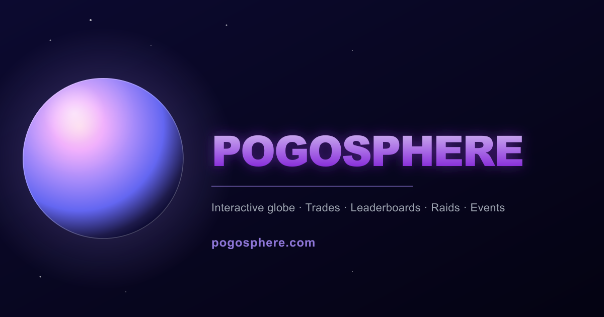

<div align="center">

# 🌍 PogoCity

### A turnkey website for your local Pokémon GO community




&nbsp;

&nbsp;


</div>

---

## 🧐 What is PogoCity?

PogoCity is a **ready-to-run website template** for Pokémon GO communities.
Each city runs its own copy — a full community portal with a **3D globe,
leaderboards, trade lists, a Pokédex tracker and an events calendar**.

**No coding required.** Fork it, edit a single file (`city.config.js`), and
your city has its own site — automatically connected to the worldwide
**Pogosphère** network.

> 🔗 **See it live:** [**pogopoitiers.fr**](https://pogopoitiers.fr) — the
> original community site PogoCity is built from. That's what your city's
> portal will look like.

```
                ┌─────────────────────────────────┐
                │          pogosphere.com         │
                │     global hub  ·  world map    │
                └─────────────────────────────────┘
                    ▲                          │
                    │  rankings & trades        │  shared events
                    │  go UP (city → hub)       │  come DOWN (hub → city)
                    │                          ▼
       ┌────────────┴───────┬──────────────────┴───────────┐
       │                    │                              │
 ┌──────────────┐    ┌──────────────┐            ┌──────────────┐
 │ PogoPoitiers │    │  your city   │            │     ...      │
 └──────────────┘    └──────────────┘            └──────────────┘
        every community runs its own PogoCity site
```

- ⬇️ **Events** flow *down* from the hub — every city shows the same calendar.
- ⬆️ **Rankings & trades** flow *up* — your trainers reach the world map.

---

## ✨ Features

| Feature | Description |
|---|---|
| 🌐 **3D globe** | Explore community cities around the world |
| 🏆 **Leaderboards** | Trainer rankings + PvP & raid tier lists |
| 🔄 **Trade hub** | Build and share trade lists |
| 📋 **Pokédex tracker** | Personal collection checklist |
| 📅 **Events** | Shared calendar, synced from the hub |
| 🔑 **Discord login** | One-click sign-in for your members |
| 🌍 **Multilingual** | French · English · Japanese |

---

## 🚀 Quick start — build your city's site

> **You'll need:** [Node.js 20+](https://nodejs.org) · a Discord account · a GitHub account

### 1️⃣ &nbsp; Get your own copy

Click the green **`Use this template`** button at the top of this page →
**Create a new repository** → name it after your city (e.g. `pogo-poitiers`).

Then, on your computer:

```bash
git clone https://github.com/YOUR-NAME/pogo-poitiers.git
cd pogo-poitiers
npm install
```

### 2️⃣ &nbsp; Configure your city

Open **`city.config.js`** and fill in your details: site name, city, domain,
language, GPS coordinates, theme color, Discord link, contact info.

> 👉 **This is the only file you need to edit.**

### 3️⃣ &nbsp; Add your secrets

```bash
cp .env.example .env.local
```

Fill in `.env.local` with your Discord credentials — see **`DISCORD_SETUP.md`**
for a step-by-step guide to creating your Discord app.

> ⚠️ **Never commit `.env.local`** — it holds your secrets (already in `.gitignore`).

### 4️⃣ &nbsp; Add your branding

Replace these files in `/public` with your own:

| File | What it is |
|---|---|
| `logo.svg` | Site logo |
| `icon-512.png` | App icon / favicon |
| `og-image.png` | Social share image (1200 × 630 px) |

### 5️⃣ &nbsp; Run it

```bash
npm run dev      # development — open the address shown in the terminal
npm run build    # production build
```

🎉 **Done — your city now has its own community site.**

---

## 🔄 Staying up to date

PogoCity keeps improving. Pull the latest features **without losing your
configuration**:

```bash
# One time only — link the original template:
git remote add upstream https://github.com/alakazam777/pogocity.git

# Whenever you want the latest updates:
git fetch upstream
git merge upstream/main
```

Your `city.config.js` and your secrets are never touched — only the shared
code is updated.

---

## 📁 Project structure

| Path | Role |
|---|---|
| `city.config.js` | **Your settings** — edit this |
| `.env.local` | **Your secrets** — create this, never commit |
| `src/` | Application code (Next.js) |
| `public/` | Images, logos, assets |
| `data/` | Local site data (created automatically) |

---

## ⚖️ Disclaimer

PogoCity is a **fan-made**, free, non-commercial community project. It is not
affiliated with, endorsed by, or sponsored by the publishers or developers of
any monster-catching game. All third-party trademarks belong to their
respective owners.
